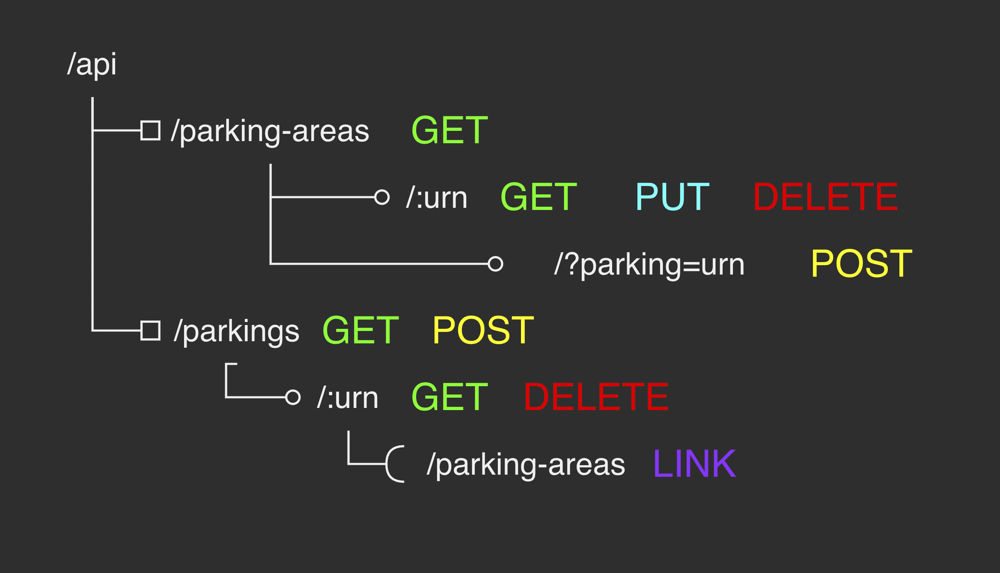

# RavenDB Hiring Task

Actually i didn't know .net platform before i started this project, but in couple
of days i realized that in this point of time i am able to write projects like
this using any language, just because it requires just understanding of
structure not more.

## Index

- [Installing](##Installing)
- [Architecture](##Architecture)
- [TODO](##TODO)

## Installing

This app is based on mono repository, so you just should do a couple of things
to deploy application.

...

## Architecture

This app uses REST resources model to manage resources:

## TODO

- Done UI
- Add Parkings Resource to the server side
- Inject Docker functionality
